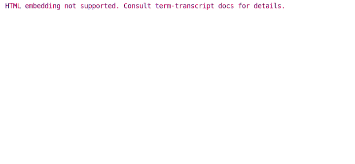
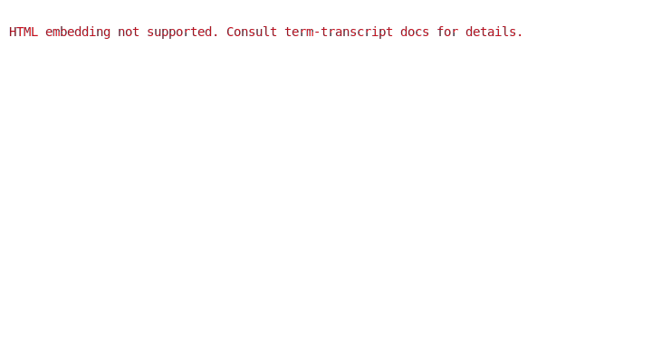

# Snapshot Testing for CLI / REPL Applications

[](https://github.com/slowli/term-transcript/actions)
[](https://github.com/slowli/term-transcript#license)


**Documentation:** [](https://docs.rs/term-transcript/)
[](https://slowli.github.io/term-transcript/term_transcript/)

This crate allows to:

- Create transcripts of interacting with a terminal, capturing both the output text
  and [ANSI-compatible color info][SGR].
- Save these transcripts in the [SVG] format, so that they can be easily embedded as images
  into HTML / Markdown documents. Rendering logic can be customized via [Handlebars] template engine;
  thus, other output formats besides SVG (e.g., HTML) are possible.
  See [crate docs][custom-templates] for an intro to custom templates.
- Parse transcripts from SVG.
- Test that a parsed transcript actually corresponds to the terminal output (either as text
  or text + colors).

The primary use case is easy to create and maintain end-to-end tests for CLI / REPL apps.
Such tests can be embedded into a readme file.

## Usage

Add this to your `Crate.toml`:

```toml
[dependencies]
term-transcript = "0.2.0"
```

Example of usage:

```rust
use term_transcript::{
    svg::{Template, TemplateOptions}, ShellOptions, Transcript, UserInput,
};
use std::str;

let transcript = Transcript::from_inputs(
    &mut ShellOptions::default(),
    vec![UserInput::command(r#"echo "Hello world!""#)],
)?;
let mut writer = vec![];
// ^ Any `std::io::Write` implementation will do, such as a `File`.
Template::new(TemplateOptions::default()).render(&transcript, &mut writer)?;
println!("{}", str::from_utf8(&writer)?);
Ok::<_, anyhow::Error>(())
```

See more examples in the crate docs.

### CLI app

Most of the library functionality is packaged into [a CLI binary][term-transcript-cli],
which allows using the library without Rust knowledge. See the binary docs
for the installation and usage guides.

### Snapshot examples

An SVG snapshot of [the `rainbow` example](e2e-tests/rainbow)
produced by this crate:



A snapshot of the same example with the scrolling animation and window frame:



A snapshot of a similar example rendered to HTML using [a custom template](examples/custom.html.handlebars)
is available [as a source file](examples/rainbow.html) and [in the rendered form][html-example].

See the [`examples` directory](examples) for more snapshot examples.

## Limitations

- Terminal coloring only works with ANSI escape codes. (Since ANSI escape codes
  are supported even on Windows nowadays, this shouldn't be a significant problem.)
- ANSI escape sequences other than [SGR] ones are either dropped (in case of [CSI] sequences),
  or lead to an error.
- By default, the crate exposes APIs to perform capture via OS pipes.
  Since the terminal is not emulated in this case, programs dependent on [`isatty`] checks
  or getting term size can produce different output than if launched in an actual shell
  (no coloring, no line wrapping etc.).
- It is possible to capture output from a pseudo-terminal (PTY) using the `portable-pty`
  crate feature. However, since most escape sequences are dropped, this is still not a good
  option to capture complex outputs (e.g., ones moving cursor).
- PTY support for Windows is shaky. It requires a somewhat recent Windows version 
  (Windows 10 from October 2018 or newer), and may work incorrectly even for the recent versions.

## Alternatives / similar tools

- [`insta`](https://crates.io/crates/insta) is a generic snapshot testing library, which
  is amazing in general, but *kind of* too low-level for E2E CLI testing.
- [`rexpect`](https://crates.io/crates/rexpect) allows testing CLI / REPL applications
  by scripting interactions with them in tests. It works in Unix only.
- [`trybuild`](https://crates.io/crates/trybuild) snapshot-tests output
  of a particular program (the Rust compiler).
- [`trycmd`](https://crates.io/crates/trycmd) snapshot-tests CLI apps using
  a text-based format.
- Tools like [`termtosvg`](https://github.com/nbedos/termtosvg) and
  [Asciinema](https://asciinema.org/) allow recording terminal sessions and save them to SVG.
  The output of these tools is inherently *dynamic* (which, e.g., results in animated SVGs).
  This crate intentionally chooses a simpler static format, which makes snapshot testing easier.

## License

Licensed under either of [Apache License, Version 2.0](LICENSE-APACHE)
or [MIT license](LICENSE-MIT) at your option.

Unless you explicitly state otherwise, any contribution intentionally submitted
for inclusion in `term-transcript` by you, as defined in the Apache-2.0 license,
shall be dual licensed as above, without any additional terms or conditions.

[SVG]: https://developer.mozilla.org/en-US/docs/Web/SVG
[Handlebars]: https://handlebarsjs.com/
[SGR]: https://en.wikipedia.org/wiki/ANSI_escape_code#SGR
[CSI]: https://en.wikipedia.org/wiki/ANSI_escape_code#CSI_(Control_Sequence_Introducer)_sequences
[`isatty`]: https://man7.org/linux/man-pages/man3/isatty.3.html
[html-example]: https://slowli.github.io/term-transcript/examples/rainbow.html
[custom-templates]: https://slowli.github.io/term-transcript/term_transcript/svg/struct.Template.html#customization
[term-transcript-cli]: https://crates.io/crates/term-transcript-cli
