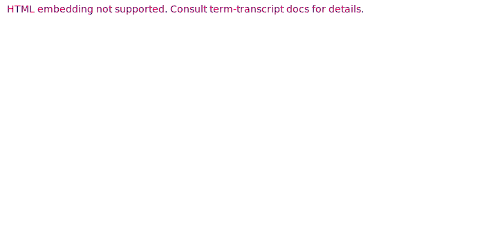

# Capturing and Snapshot Testing for CLI / REPL Applications

`term-transcript` is a Rust library and a CLI app that allow to:

- Create transcripts of interacting with a terminal, capturing both the output text
  and [ANSI-compatible color info][SGR].
- Save these transcripts in the [SVG] format, so that they can be easily embedded as images
  into HTML / Markdown documents. Rendering logic can be customized via [Handlebars] template engine;
  thus, other output formats besides SVG (e.g., HTML) are possible.
- Parse transcripts from SVG.
- Test that a parsed transcript actually corresponds to the terminal output (either as text
  or text + colors).

The primary use case is easy to create and maintain end-to-end tests for CLI / REPL apps.
Such tests can be embedded into a readme file.

## Usage

`term-transcript` comes in two flavors: a [Rust library](lib), and a [CLI app](cli).
The CLI app has slightly less functionality, but does not require Rust knowledge.
See their docs and the [FAQ](FAQ.md) for usage guidelines and troubleshooting advice.

### Examples

An SVG snapshot of [the `rainbow` script](examples/rainbow/rainbow)
produced by this crate:

A snapshot of the same example with the scrolling animation and window frame:

A snapshot of a similar example rendered to HTML using [a custom template](examples/custom.html.handlebars)
is available [as a source file](examples/rainbow.html) and [in the rendered form][html-example].

See the [`examples` directory](examples) for more snapshot examples.

## Contributing

All contributions are welcome! See [the contributing guide](CONTRIBUTING.md) to help
you get involved.

## License

All code is licensed under either of [Apache License, Version 2.0](LICENSE-APACHE)
or [MIT license](LICENSE-MIT) at your option.

Unless you explicitly state otherwise, any contribution intentionally submitted
for inclusion in `term-transcript` by you, as defined in the Apache-2.0 license,
shall be dual licensed as above, without any additional terms or conditions.

[SVG]: https://developer.mozilla.org/en-US/docs/Web/SVG
[Handlebars]: https://handlebarsjs.com/
[SGR]: https://en.wikipedia.org/wiki/ANSI_escape_code#SGR
[CSI]: https://en.wikipedia.org/wiki/ANSI_escape_code#CSI_(Control_Sequence_Introducer)_sequences
[html-example]: https://slowli.github.io/term-transcript/examples/rainbow.html
