# Basic Usage

## Static snapshot


Generating command:

```bash
term-transcript exec --palette gjm8 rainbow
```

Here, `--palette` defines the color palette to use for the 16 base ANSI colors.

> [!NOTE]
>
> `rainbow` is an [executable script](./#rainbow-script) for end-to-end tests.

## Static snapshot (pure SVG)

`--pure-svg` flag makes `term-transcript` to produce pure SVG instead of default HTML-in-SVG.
This is more compatible (HTML-in-SVG is not supported by all SVG browsers), but has its quirks.
In particular, [font advance width](#advance-width) is set to an imprecise hard-coded value
unless a font [is embedded](fonts.md#embedding-custom-fonts) into the snapshot; this may lead
to various display artifacts, such as stretched or compressed text, interrupted underlines, etc.



Generating command:

```bash
term-transcript exec --pure-svg --palette gjm8 rainbow
```

## Animated snapshot


Generating command:

```bash
term-transcript exec --palette powershell --line-height=18px \
   --scroll --pty --window='rainbow, rainbow --long-lines' \
   rainbow 'rainbow --long-lines'
```

> [!NOTE]
>
> The `--pty` flag creates a pseudo-terminal for capture instead of default pipes.

> [!TIP]
>
> Scroll animation is highly customizable! See [*Window Appearance*](window.md#scroll-animation) section for details.

## Line height

In the example above, `--line-height` explicitly sets the line height for the snapshot.
It can be specified both in pixels or in ems (i.e., relative to the font size which is hard-coded to 14px).
By default, line height is set to 1.2em = 16.8px, unless [a font is embedded](fonts.md#embedding-custom-fonts),
in which case the optimal line height is obtained from the font metrics.

## Advance width

`--advance-width` sets the advance width (aka char width) of a font. Similarly to `--line-height`,
it can be measured in either pixels or ems.

Advance width is important for [pure SVG](#static-snapshot-pure-svg) since it's relied upon
to correctly position background color boxes. If [a font is embedded](fonts.md#embedding-custom-fonts),
advance width is obtained from font metrics. Otherwise, it's estimated as 8px (~0.57em),
which may lead to stretched or compressed layout, depending on the font used. You may want to override
the advance width in this case, or to embed the font into the snapshot in this case.

> [!IMPORTANT]
> 
> Currently, advance width is ignored for the default (HTML-in-SVG) template.

See [font examples](fonts.md) for the examples of setting `--advance-width`.
