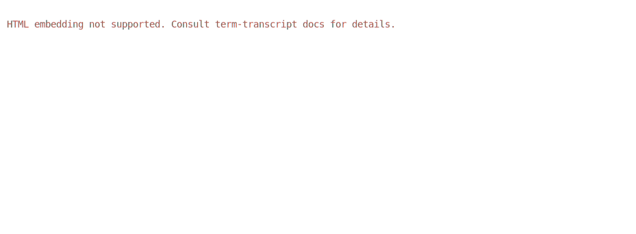

# Custom Template and Config

`term-transcript` allows overwriting the Handlebars template, or to collect all config options
into a single TOML file.

## Custom template

Using the `--tpl` option, it's possible to use a custom [Handlebars](https://handlebarsjs.com/) template
rather than the standard ones. As an example, [this template](../assets/custom.html.handlebars) renders a transcript [into HTML](../assets/rainbow.html).

```bash
term-transcript exec --tpl custom.html.handlebars \
  -o rainbow.html rainbow 'rainbow --short'
```

## Configuration file

`--config-path` option allows reading rendering options from a TOML file. This enables
configuring low-level template details. The snapshot below uses a [configuration file](../assets/config.toml)
to customize palette colors and scroll animation step / interval.



Generating command:

```bash
term-transcript exec --config-path config.toml \
  'rainbow --long-lines'
```
