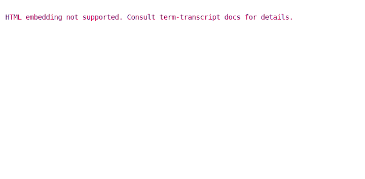
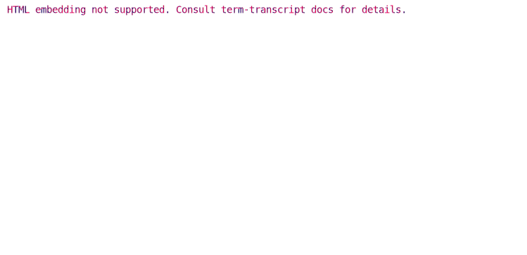

# Custom Fonts

Using `--styles` and `--font` options, it's possible to use a custom font in the snapshot.
For example, the snapshot below uses [Fira Mono](https://github.com/mozilla/Fira):



Note that the custom font will only be displayed when viewed in the browser
if the [Content Security Policy][CSP] of the HTTP server hosting the SVG allows to do so.
See the [FAQ](../FAQ.md#transcripts--content-security-policy) for more details.

Generating command:

```bash
term-transcript exec --palette gjm8 --window \
  --font 'Fira Mono, Consolas, Liberation Mono, Menlo' \
  --styles '@import url(https://code.cdn.mozilla.net/fonts/fira.css);' rainbow
```

The same snapshot rendered with pure SVG:



```bash
term-transcript exec --pure-svg --palette gjm8 --window \
  --font 'Fira Mono, Consolas, Liberation Mono, Menlo' \
  --styles '@import url(https://code.cdn.mozilla.net/fonts/fira.css);' rainbow
```

[CSP]: https://developer.mozilla.org/en-US/docs/Web/HTTP/CSP

## Embedding custom fonts

Using `--embed-font`, it's possible to embed a font into the snapshot (rather than hot-linking it
as with `--font`). The font is *subset* before embedding, meaning that only glyphs for chars
used in the transcripts are retained; this means that the font overhead is not that significant (order of 10 kB).
For example, the snapshot below embeds [Roboto Mono](https://fonts.google.com/specimen/Roboto+Mono):



Generating command:

```bash
term-transcript exec --palette gjm8 \
  --line-numbers continuous \
  --embed-font=fonts/RobotoMono.ttf \
  'rainbow --short'
```

The embedded Roboto Mono font is [*variable*][variable-fonts] by font weight, meaning that it has the bold version
(weight: 700) embedded as well. In contrast, the *italic* font face must be synthesized by the browser.
It is possible to embed the italic font face as well by specifying 2 paths for `--embed-font`:



```bash
term-transcript exec --palette gjm8 \
  --line-numbers continuous \
  --line-height=1.4em \
  --dim-opacity 0.5 \
  --blink-opacity 0 --blink-interval 500ms \
  --embed-font="fonts/RobotoMono.ttf:fonts/RobotoMono-Italic.ttf" \
  --pure-svg \
  'rainbow --short'
```

Another example: [Fira Mono](https://fonts.google.com/specimen/Fira+Mono), which is a non-variable font.
We embed its regular and **bold** faces (i.e., *italic* is synthesized):



```bash
term-transcript exec --palette gjm8 \
  --line-numbers continuous \
  --embed-font="fonts/FiraMono-Regular.ttf:fonts/FiraMono-Bold.ttf" \
  --advance-width=8.6px \
  --pure-svg \
  'rainbow --short'
```

The same note regarding [content security policy][CSP] applies.

[variable-fonts]: https://learn.microsoft.com/en-us/typography/opentype/spec/otvaroverview
