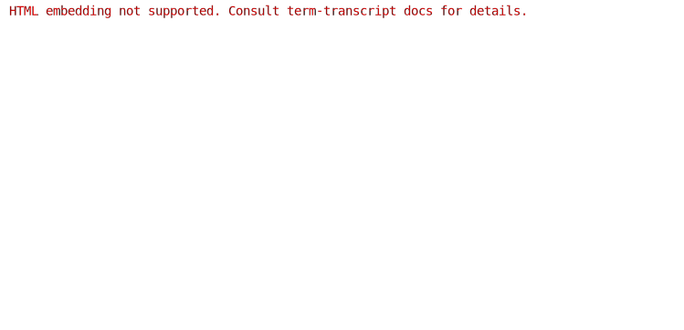

# Controlling Inputs

`--no-inputs` flag allows hiding user inputs in the generated snapshots.

## Hiding all inputs



Generating command:

```bash
term-transcript exec --scroll --palette xterm \
  --no-inputs --line-numbers continuous \
  rainbow 'rainbow --short'
```

Same snapshot generated using the pure SVG template (i.e., with the additional
`--pure-svg` flag):



```bash
term-transcript exec --pure-svg --scroll --palette xterm \
  --no-inputs --line-numbers continuous \
  rainbow 'rainbow --short'
```
