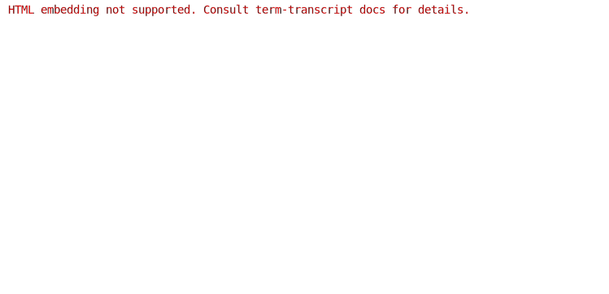
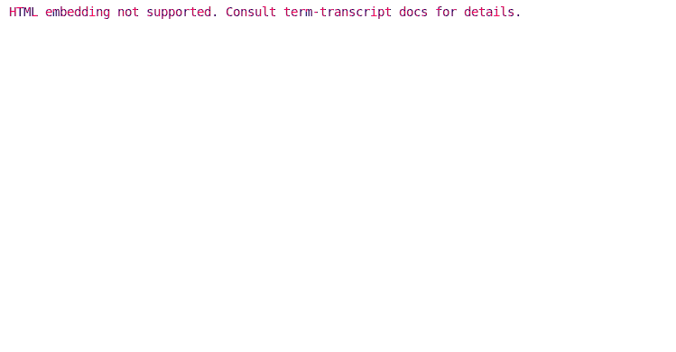

# Line Numbering

`--line-numbers` option and some others described below control how lines are numbered
in the generated snapshot.

`--line-numbers` accepts following values:

- [`continuous-outputs`](#continuous-numbering-for-outputs) *(default)*:
  Uses a single numbering scope for all outputs. Inputs are not numbered.
- [`continuous`](#continuous-numbering-for-inputs-and-outputs): Uses a single numbering scope
  throughout all inputs and outputs.
- [`each-output`](#separate-numbering-for-each-output): Numbers each output separately. Inputs are not numbered.

## Separate numbering for each output



Generating command:

```bash
term-transcript exec --scroll --palette xterm \
  --line-numbers each-output \
  rainbow 'rainbow --short'
```

## Continuous numbering for outputs


Generating command:

```bash
term-transcript exec --scroll --palette powershell \
  --line-numbers continuous-outputs \
  --line-height=1.4em \
  rainbow 'rainbow --short'
```

## Continuous numbering for inputs and outputs


Generating command:

```bash
term-transcript exec --scroll --palette gjm8 \
  --line-numbers continuous \
  --scroll-interval 2s --scroll-len 2em \
  rainbow 'rainbow --short'
```

Same snapshot generated using the pure SVG template (i.e., with the additional
`--pure-svg` flag):



```bash
term-transcript exec --pure-svg --scroll --palette gjm8 \
  --line-numbers continuous \
  --scroll-interval 2s --scroll-len 2em \
  rainbow 'rainbow --short'
```

## Numbering with line breaks

As the example below shows, what is numbered by default are *displayed* lines
obtained after potential line breaking.



Generating command:

```bash
term-transcript exec --palette gjm8 \
  --line-numbers \
  --line-height 18px \
  'rainbow --long-lines'
```

This behavior can be changed with the `--continued-mark` arg. If set, the mark will be output before each line
continuation instead of the line number. Similarly, `--hard-wrap-mark` changes the mark placed at the end of wrapped
lines.



```bash
term-transcript exec --pure-svg --palette gjm8 \
  --line-numbers \
  --continued-mark '' \
  --line-height 18px \
  --advance-width 7.8px \
  'rainbow --long-lines'
```


```bash
term-transcript exec --palette gjm8 \
  --line-numbers \
  --continued-mark '…' \
  --hard-wrap-mark '—' \
  'rainbow --long-lines'
```
