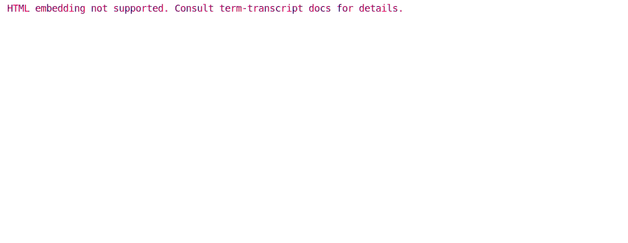
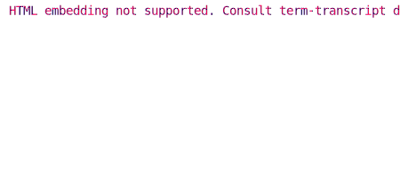

# Configuring Window Appearance

There are dedicated args to control window sizing and title.

## Setting width



Use `--width` to control the pixel width of the console, and `--hard-wrap` to control
at which char the console output is hard-wrapped to a new line. It usually makes sense
to set these both params: `width ≈ hard_wrap * 9` (the exact coefficient depends on
the font being used).

Generating command:

```bash
term-transcript exec --palette gjm8 \
  --hard-wrap=100 --width=900 'rainbow --long-lines'
```

## Setting scroll height



Use `--scroll=$height` to set the maximum pixel height of the snapshot.

Generating command:

```bash
term-transcript exec --palette gjm8 \
  --hard-wrap=50 --width=450 --scroll=180 rainbow
```

## Setting window title

TODO
