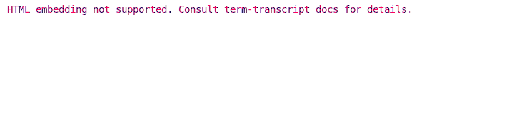

# E2E Test for term-transcript

The crate has a separate REPL binary that echoes provided input
with colors / styles applied according to keywords:

## Why separate crate?

Although Cargo builds example targets when testing, it does not enforce
a particular build order and appends a suffix for the names of produced executables. 
This makes it quite difficult to use an executable example for E2E tests.
Binary targets are much easier because they are guaranteed to be built before
integration tests, and are named properly.
