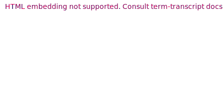
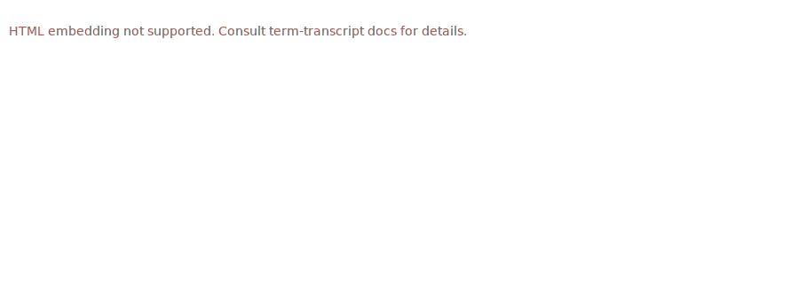

# Snapshot Showcase

This file showcases snapshot examples generated by the [`term-transcript` CLI app](../cli).
Consult the [generating script](generate-snapshots.sh) for details on preparing the environment.

## Basics

### Static snapshot


Generating command:

```shell
term-transcript exec -T 250ms --palette gjm8 rainbow
```

(`rainbow` is an executable for [end-to-end tests](../e2e-tests/rainbow).)

### Static snapshot (pure SVG)


Generating command:

```shell
term-transcript exec -T 250ms --pure-svg --palette gjm8 rainbow
```

### Animated snapshot


Generating command:

```shell
term-transcript exec -T 250ms --palette powershell \
  --pty --window --scroll rainbow 'rainbow --long-lines'
```

Note the `--pty` flag to use a pseudo-terminal for capture instead of default pipes.

## Configuring console size

### Setting width


Use `--width` to control the pixel width of the console, and `--hard-wrap` to control
at which char the console output is hard-wrapped to a new line. It usually makes sense
to set these both params: `width ≈ hard_wrap * 9` (the exact coefficient depends on
the font being used).

Generating command:

```shell
term-transcript exec -T 250ms --palette gjm8 \
  --hard-wrap=100 --width=900 'rainbow --long-lines'
```

### Setting scroll height



Use `--scroll=$height` to set the maximum pixel height of the snapshot.

Generating command:

```shell
term-transcript exec -T 250ms --palette gjm8 \
  --hard-wrap=50 --width=450 --scroll=180 rainbow
```

## Line numbering

### Separate numbering for each output


Generating command:

```shell
term-transcript exec -T 250ms --scroll --palette xterm \
  --line-numbers each-output \
  rainbow 'rainbow --short'
```

### Continuous numbering for outputs


Generating command:

```shell
term-transcript exec -T 250ms --scroll --palette powershell \
  --line-numbers continuous-outputs \
  rainbow 'rainbow --short'
```

### Continuous numbering for inputs and outputs


Generating command:

```shell
term-transcript exec -T 250ms --scroll --palette gjm8 \
  --line-numbers continuous \
  rainbow 'rainbow --short'
```

Same snapshot generated using the pure SVG template (i.e., with the additional
`--pure-svg` flag):


### Numbering with line breaks

As the example below shows, what is numbered are *displayed* lines
obtained after potential line breaking.


Generating command:

```shell
term-transcript exec -T 250ms --palette gjm8 \
  --line-numbers continuous \
  'rainbow --long-lines'
```

Same snapshot generated using the pure SVG template (i.e., with the additional
`--pure-svg` flag):


## Hiding user inputs

Combined with line numbering and scrolling to test more features.


Generating command:

```shell
term-transcript exec -T 250ms --scroll --palette xterm \
  --no-inputs --line-numbers continuous \
  rainbow 'rainbow --short'
```

Same snapshot generated using the pure SVG template (i.e., with the additional
`--pure-svg` flag):


## Custom fonts

Using `--styles` and `--font` options, it's possible to use a custom font in the snapshot.
For example, the snapshot below uses [Fira Mono](https://github.com/mozilla/Fira):


Note that the custom font will only be displayed when viewed in the browser
if the [Content Security Policy][CSP] of the HTTP server hosting the SVG allows to do so.
See the [FAQ](../FAQ.md#transcripts--content-security-policy) for more details.

Generating command:

```shell
term-transcript exec -T 250ms --palette gjm8 --window \
  --font 'Fira Mono, Consolas, Liberation Mono, Menlo' \
  --styles '@import url(https://code.cdn.mozilla.net/fonts/fira.css);' rainbow
```

[CSP]: https://developer.mozilla.org/en-US/docs/Web/HTTP/CSP

## Configuration file

`--config-path` option allows reading rendering options from a TOML file. This enables
configuring low-level template details. The snapshot below uses a [configuration file](config.toml)
to customize palette colors and scroll animation step / interval.



Generating command:

```shell
term-transcript exec -T 250ms --config-path config.toml \
  'rainbow --long-lines'
```

## Failed inputs

Some shells may allow detecting whether an input resulted in a failure
(e.g., *nix shells allow doing this by comparing the output of `echo $?` to 0,
while in PowerShell `$?` can be compared to `True`). Such failures are captured
and visually highlighted the default SVG template.

### Failures in `sh`


Generating command:

```shell
term-transcript exec -T 250ms --palette gjm8 --window \
  './non-existing-command' \
  '[ -x non-existing-file ]' \
  '[ -x non-existing-file ] || echo "File is not there!"'
```

### Failures in `bash`

Captured using a pseudo-terminal, hence colorful `grep` output.


Generating command:

```shell
term-transcript exec -T 250ms --palette gjm8 \
  --pty --window --shell bash \
  'ls -l Cargo.lock' \
  'grep -n serge Cargo.lock' \
  'grep -n serde Cargo.lock'
```

### Failures in `pwsh`


```shell
term-transcript exec --window --palette gjm8 \
  --shell pwsh './non-existing-command'
```
